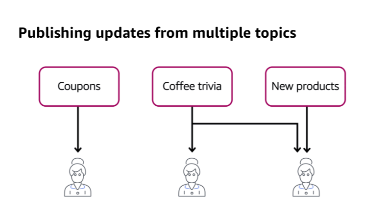
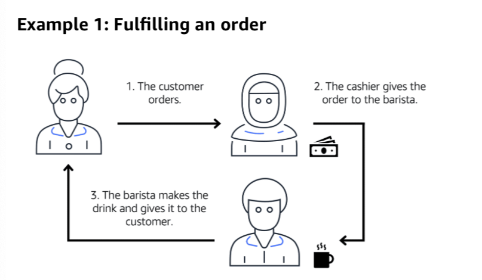
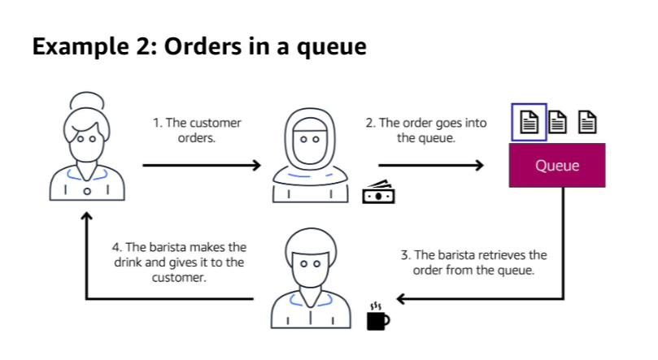
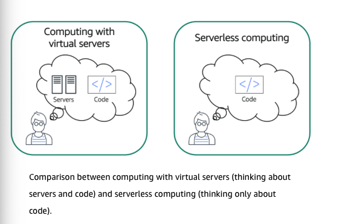

# Cloud practitioner

# Module 1: Cloud computing

In this module, you will learn how to:

- Summarize the benefits of AWS.
- Describe differences between on-demand delivery and cloud deployments.
- Summarize the pay-as-you-go pricing model.

## Cloud computing

Deployment models for cloud computing

- Cloud-based
- On-premises
- Hybrid

# Module 2: Compute in the cloud

In this module, you will learn how to:

- Describe the benefits of Amazon EC2 at a basic level.
- Identify the different Amazon EC2 instance types.
- Differentiate between the various billing options for Amazon EC2.
- Summarize the benefits of Amazon EC2 Auto Scaling.
- Summarize the benefits of Elastic Load Balancing.
- Give an example of the uses for Elastic Load Balancing.
- Summarize the differences between Amazon Simple Notification Service (Amazon SNS) and Amazon Simple Queue Service (Amazon SQS).
- Summarize additional AWS compute options.

## EC2

Vertical scaling

### Amazon EC2 Instances family

#### General purpose

General purpose instances price a balance of compute, memory, and networking resources.
You can use them for a variety of workloads, such as:

- application servers
- gaming servers
- back-end servers for enterprise applications
- small and medium databases

Suppose that you have a application in which the resource needs for compute,
memory, and networking are roughly equivalent. You might consider running
it on a general purpose instance because the application does not require
optimization in any single resource area.

#### Compute optimized

Compute optimized instances are ideal for compute-bound application that benefit
from high-performance processors. Like general purpose instances, you can use
compute optimized instances for workloads such as web, application,
and gaming servers.

However, the difference is compute optimized applications are ideal
for high-performance web servers, compute-intensive applications servers,
and dedicated gaming servers. You can also use compute optimized instances for
batch processing workloads that require processing many transactions
in a single group.

#### Memory optimized

Memory optimized instances are designed to deliver fast performance for
workloads that process large datasets in memory. In computing,
memory is a temporary storage area. It holds all the data and instructions
that a central processing unit (CPU) needs to be able to complete actions.
Before a computer program or application is able to run, it is loaded from storage
into memory. This preloading process gives the CPU direct access to
the computer program.

Suppose that you have a workloads that requires large amounts of data to be
preloaded before running an application. This scenario might be a
high-performance database or a workload that involves preforming real-time
processing of a large amount of unstructured instances enable you to run
workloads with high memory needs an receive great performance.

#### Accelerated computing

Accelerated instances use hardware accelerators, or coprocessors, to perform
some functions more efficiently that is possible in software running on CPUs.
Example of these functions include floating-point number calculations,
graphics processing, and data pattern matching.

In computing, a hardware accelerator is a component that can expedite data processing.
Accelerated computing instances are ideal for workloads such as graphics applications,
game streaming, and application streaming.

#### Storage optimized

Storage optimized instances are designed for workloads that require high,
sequential read and write access to large datasets on local storage.
Examples of workloads suitable for storage optimized instances include
distributed file system, data warehousing applications, and high-frequency online
transaction processing (OLTP) systems.

In computing, the term input/output operations per second (IOPS) is a metric that measures the performance of a storage device. It indicates how many different input or output operations a device can perform in one second. Storage optimized instances are designed to deliver tens of thousands of low-latency, random IOPS to applications.

You can think of input operations as data put into a system, such as records entered into a database. An output operation is data generated by a server. An example of output might be the analytic performed on the records in a database. If you have an application that has a high IOPS requirement, a storage optimized instance can provide better performance over other instance types not optimized for this kind of use case.

#### Questions

Which Amazon EC2 instance type is ideal for high-performance databases?
Memory optimized

### Amazon EC2 pricing

#### On-Demand

On-demand instances are ideal fro short-term, irregular workloads that cannot be interrupted. No upfront costs or minimum contracts apply. The instances run continuously until you stop them, and you pay for only the compute time you use.

Sample use cases for On-demand instances include developing and testing applications and running applications that have unpredictable usage patterns. On-demand instances are not recommended for workloads that last a year or longer because these workloads can experience greater cost savings using Reseverd instances.

#### Reserved instances

Reserved instances are a billing discount applied to the use of On-Demand instances in you account: There are two available types of:

##### Standard reserved instances

This option is a good fit if you know the EC2 instance type and size you need for your steady-state applications and in which AWS Region you plan to run them. Reserved instances require you to state the following qualifications:

- Instance type and size: For example, m5.xlarge
- Platform description (operating system): For example, Microsoft Windows Server or Red Hat Enterprise Linux
- Tenancy: Default tenancy or dedicated tenancy

You have the option to specify an Availability Zone for your EC2 reserved instances. If you make this specification, you get EC2 capacity reservation. This ensures that your desired amount of EC2 instances will be available when you need them.

Standard Reserved Instances require you to specify:

- Instance family and size
- Platform description
- Tenancy
- Region

Your specified amount of EC2 instances are covered over a 1-year or 3-year term.

##### Convertible reserved

If you need to run your EC2 instances in different Availability Zones or different instance types, the Convertible Reserved Instances might be right for you. **Note**: You trade in a deeper discount when you require flexibility to run your EC2 instances.

At the end of a Reserved Instances term, you an continue using the Amazon EC2 instance without interruption. However, you are charged On-Demand rates until you do one of the following:

- Terminate the instance.
- Purchase a new Reserved Instance that matches the instance attributes (instance family and size, Region, platform, and tenancy).

#### Savings Plans

EC2 Savings Plans reduce your EC2 instance costs when you make an hourly spend commitment to an instance family and Region for a 1-year or 3-year term.

This term commitment results in savings of up to 72 percent compared to On-Demand rates. Any usage up to the commitment is charged at the discounted savings plans rate (for example, $10 per hour). Any usage beyond the commitment is charged at regular On-Demand rates.

The EC2 Savings Plans are a good option if you need flexibility in you Amazon EC2 usage over the duration of the commitment term.

Unlike Reserved Instances, however, you don't need to specify up from want EC2 instance type and size (for example, m5.xlarge), OS, and tenancy to get a discount. Further, you don't need to commit to a certain number of EC2 instances over a 1-year or 3-year term. Additionally, the EC2 Instance Savings Plans don't include an EC2 capacity reservation option.

##### EC2 Instance Savings

Plans reduce your EC2 instance costs when you make an hourly spend commitment to an instance family and Region for a 1-year or 3-year term.

#### Spot Instances

Spot Instances are ideal for workloads with flexible start and end times, or that can withstand interruptions. Spot Instances use unused Amazon EC2 computing capacity and offer you cost savings at up to 90% off of On-Demand prices.

Suppose that you have a background processing job that can start and stop as needed (such as the data processing job for a customer survey). You want to start and stop the processing job without affecting the overall operations of your business.

If you make a Spot request and Amazon EC2 capacity is available, your Spot Instance launches. However, if you make a Spot request and Amazon EC2 capacity is unavailable the request is no successful until capacity becomes available. The unavailable capacity might delay the launch of you background processing job.

#### Dedicated Hosts

Dedicated Hosts are physical servers with Amazon EC2 instance capacity that is fully dedicated to your use.

You can use your existing per-socket, per-core, or per-VM software licenses to help maintain license compliance. You can purchase On-Demand Dedicated Hosts and Dedicated Hosts Reservations. Of all the Amazon EC2 options that were covered, Dedicated Hosts are the most expensive.

### Questions

Which Amazon EC2 pricing option provides a discount when you specify a number of EC2 instances to run a specific OS, instance family and size, and tenancy in one Region?

Standard Reserved Instances

## Scaling Amazon EC2

## Part 1

### Scalability

Scalability involves beginning with only the resources you need and designing your architecture to
automatically respond to changing demand by scaling out or in. As a result you pay for only the resources you use.

You don't have to worry about a lack of computing capacity to meet your customers' needs.

If you wanted the scaling process to happen automatically, which AWS service would you use? The AWS service that provides this functionality for Amazon EC2 instances is _Amazon EC2 Auto Scaling_.

### Amazon EC2 Auto Scaling

If you've tried to access a website that wouldn't load a frequently timed out, the website might have received more request than it was able to handle. This situation is similar to waiting in a long line at a coffee shop, when there is only one barista present to take orders from customers.

Amazon EC2 Auto Scaling enables you to automatically add or remove Amazon EC2 instances in response to changing application demand. By automatically scaling your instances in and out as needed, you can maintain a greater sense of application availability.

Within Amazon EC2 Auto Scaling, you can use two approaches: dynamic scaling and predictive scaling.

- Dynamic scaling responds to changing demand.
- Predictive scaling automatically schedules the right number of Amazon EC2 instances based on predicted demand.

## Part 2

Example: Amazon EC2 Auto Scaling

In the cloud, computing power is a programmatic resource, so you can take a more flexible approach to the issue of scaling. By adding Amazon EC2 Auto Scaling to an application, you can add new instances to the application when necessary and terminate them when no longer needed.

Suppose that you are preparing to launch an application on Amazon EC2 instances.

When configuring the size of your Auto Scaling group, you might set the minimum number of Amazon EC2 instances at one. This means that at all times, there must be at least one Amazon EC2 instance running.

When you create an Auto Scaling group, you can set the minimum number of Amazon EC2 instances. The **minimum capacity** is the number of Amazon EC2 instances that launch immediately after you have created the Auto Scaling group. In this example, the Auto Scaling group has a minimum capacity of one Amazon EC2 instance.

Next, you can set the **desired capacity** at two Amazon EC2 instances even though your application needs a minimum of a single Amazon EC2 instance to run.

The third configuration that you can set in an Auto Scaling group is the maximum capacity. For example, you might configure The Auto Scaling group to scale out in response to increased demand, but only to a maximum of four Amazon EC2 instances.

Because Amazon EC2 Auto Scaling uses Amazon EC2 instances, you pay for only the instances you use, when you use them. You now have a cost -effective architecture that provides the best customer experience while reducing expenses.

## Directing Traffic with Elastic Load Balancing

### Elastic Load Balancing

Elastic Load Balancing is the AWS service that automatically distributes incoming application traffic across multiple resources, such as Amazon EC2 instances.

A load balancer acts as a single point of contact for all incoming web traffic to your Auto Scaling group. This means that as you add or remove Amazon EC2 instances in response to the amount of incoming traffic, these requests route to the load balancer first. Then, the requests spread across multiple resources that will handle them. For example if you have multiple Amazon EC2 instances, Elastic Load Balancing distributes the workload across the multiple instances so that so single instance has to carry the bulk of it.

Although Elastic Load Balancing and Amazon EC2 Auto scaling are separate services, they work together to help ensure that application running in Amazon EC2 can provide high performance and availability.

##### Low-demand period

Here's an example of how Elastic Load Balancing works. Suppose that a few customers have come to the coffee shop a=nd are ready to place their orders.

If only a few registers are open, this matches the demand of customers who need service. The coffee shop is less likely to have open registers with no customers. In this example, you can think of the registers as Amazon EC2 instances

![[elastic-load-balancing.png]]

##### High-demand period

Throughout the day, as the number of customers increases, the coffee shop opens more registers to accommodate them.

Additionally, a coffee shop employee directs customers to the most appropriate register so that the number of requests can evenly distribute across the open registers. You can think of this coffee shop employee as a load balancer.

![[elastic-load-balancing-high-demand-period.png]]

## Messaging and Queuing

### Amazon Simple Notification Service (Amazon SNS)

Amazon Simple Notification Service (Amazon SNS) is a publish/subscribe service. Using Amazon SNS topics, a publisher publishes messages to subscribers. This is similar to the coffee shop; the cashier provides coffee orders to the barista who makes the drinksrc/assets/publishing-updates-from-single-topic.png)

Suppose that the coffe shop has a single newsletter that includes updates from all areas of its business. It includes topics such as coupons, coffee trivia, and new products.

All of these topics are grouped because this is a single newsletter. All customers who subscribe to the newsletter receive updates about coupons, coffee trivia, and new products.

After a while, some customers express that they would prefer to receive separate newsletters for only the specific topics that interest them. The coffee shop owners decide tot try this approach.

#### Publishing updates from multiple topics (Step 2)

Image source: AWS Skill Builder

Now, instead of having a single newsletter for all topics, the coffee shop has broken it up into three separate newsletters. Each newsletter is devoted to a specific topic: coupons, coffee trivia, and new products.

Subscribers will now receive updates immediately for only the specific topics to which they have subscribed.

It is possible for subscribers to subscribe to a single topic or to multiple topics. For example, the first customer subscribes to only the coupons topic, and the second subscriber subscribers to only the coffee trivia topic. The third customer subscribers to both the coffee trivia and new products topics.

Amazon Simple Queue Service (Amazon SQS) is a message queuing service.

Using Amazon SQS, you can send, store, and receive messages between software components, without losing messages or requiring other services to be available. In Amazon SQS, an application sends messages into a queue. A user or services retrieves a message from the queue, processes it, and then deletes it from the queue.

To review two examples of how to use Amazon SQS, choose the arrow buttons to display each one.

#### Example 1: Fulfilling an order

Image source: AWS Skill Builder

Suppose that the coffee shop has an ordering process in which a cashier takes orders, and a barista makes the orders. Think of the cashier and the barista as two separate components of an application.

First, the cashier takes an order and writes it down on a piece of paper. Next, the cashier delivers the paper to the barista. Finally, the barista makes the drink and gives it to the customer.

When the next order comes in, the process repeats. This process runs smoothly as long as both the cashier and the barista are coordinated.

What might happen if the cashier took an order and went to deliver it to the barista, but the barista was out on a break or busy with another order? The cashier would need to wait until the barista is ready to accept the order. This would cause delays in the ordering process and require customers to wait longer to receive their orders.

As the coffee shop has become more popular and the ordering line is moving more slowly, the owners notice that the current ordering process is time consuming and inefficient. They decide to try a different approach that uses a queue.

#### Example 2: orders in a queue

Image source: AWS Skill Builder

Recall that the cashier and the barista are two separate components of an application. A message queuing service, such as Amazon SQS, lets messages between decoupled application complements.

In this example, the first step in the process remains the same as before: a customer places an order with the cashier.

The cashier puts the order into a queue. You can think of this as an order board that servers as a buffer between the cashier and the barista. Even if the barista is out on a break or busy with another order, the cashier can continue placing new orders into a queue.

Next, the barista checks the queue and retrieves the order.

The barista prepares the drink and gives it to the customer.

The barista then removes the completed order from the queue.

While the barista is preparing the drink, the cashier is able to continue taking new orders and add them to the queue.

## Additional compute services

#### Serverless computing

Earlier in this module, you learned about Amazon EC2, a service that lets you run virtual servers in the cloud. If you have applications that you want to run in Amazon EC2, you must do the following.

1. Provision instances (virtual servers)
2. Upload your code.
3. Continue to manage the instances while your application is running

Image source: AWS Skill Builder

The term "serverless" means that your code runs on servers, but you do not need to provision or manage these servers. With serverless computing, you can focus more on innovating new products and features instead of maintaining servers.

Another benefit of serverless computing is the flexibility to scale serverless applications automatically. Serverless computing can adjust the applications' capacity modifying the units of consumptions, such a throughput and memory.

An AWS service for serverless computing is AWS Lambda

#### AWS Lambda

AWS Lambda is a service that lets you run code without needing to provision or manage servers.

While using AWS lambda, you pay only for the compute time that you consume. Charges apply only when your code is running. You can also run code for virtually any type of application or backend service, all with zero administration.

For example, a simple Lambda function might involve automatically resizing uploaded images to the AWS Cloud. In this case, the function triggers when uploading a new image.

### How AWS Lambda works

![[Screenshot 2025-02-03 at 6.22.30 PM.png]]

1. You upload your code to Lambda.
2. You set your code to trigger from an event source, such as AWS services, mobile applications, or HTTP endpoints.
3. Lambda runs your code only when triggered.
4. You pay only for the compute time that you use. In the previous example for resizing images, you would pay only for the compute time that you use when uploading new images. Uploading the images triggers lambda to run code for the image resizing function.

In AWS, you can also build an run containerized applications.

### Containers

Containers provide you with a standard way to package your application's code and dependencies into a single object. You can also use containers fro processes and workflows in which there are essential requirements for security, reliability, and scalability.

### One host with multiple containers

Suppose that a company's application developer has an environment on their computer that is different from the environment on the computers used by the IT operations staff. The developer wants to ensure that the application's environment remains consistent regardless of deployment, so they use a containerized approach. This helps to reduce time spent debugging applications and diagnosing differences in computing environments.

### Tens of hosts with hundreds of containers

When running containerized applications, it's important to consider scalability. Suppose that instead of a single host with multiple containers, you have to manage tens of hosts with hundreds of containers. Alternatively, you have to manage possibly hundreds of hosts with thousands of containers. At a large scale, image how much time it might take for you to monitor memory usage, security, logging, and so on.

### Amazon Elastic Container Service (ECS)

Amazon Elastic Container Services is a high scalable, high-performance container management system that enables you to run and scale containerized applications on AWS.

Amazon ECS supports Docker containers. Docker is a platform that enables you to build, test, and deploy application quickly. AWS supports the use open-source Docker Community Edition and subscription-based Docker Enterprise Edition. With Amazon ECS, you can use API Calls to launch and stop Docker-enabled application.

### Amazon Elastic Kubernetes Service (EKS)

Amazon Elastic Kubernetes Service is a fully managed service that you can use to run Kubernetes on AWS.

Kubernetes is open-source software that enables you to deploy and managed containerized application at scale. A large community of volunteers maintains Kubernetes, and AWS actively works together with the Kubernetes community. As new feature and functionalities release for Kubernetes applications, you can easily apply these updates to your applications managed by Amazon EKS

### Amazon Fargate

Amazon Fargate is a serverless compute engine for containers. It works with both Amazon ECS and Amazon EKS.

When using Amazon Fargate you do not need to provision and manage servers. Amazon Fargate manages your servers infrastructure for you. You can focus more on innovating and developing your applications, and you pay only for the resources that are required to run your containers.

## Module 2 Quiz

You want to use an Amazon EC2 instance for a batch processing workload. What would be the best Amazon EC2 instance type to use?
R:// Compute optimized

The correct response option is Compute optimized.

The other response options are incorrect because:
General purpose instances provide a balance of compute, memory, and networking resources. This instance family would not be the best choice for the application in this scenario. Compute optimized instances are more well suited for batch processing workloads than general purpose instances.
Memory optimized instances are more ideal for workloads that process large datasets in memory, such as high-performance databases.

Storage optimized instances are designed for workloads that require high, sequential read and write access to large datasets on local storage. The question does not specify the size of data that will be processed. Batch processing involves processing data in groups. A compute optimized instance is ideal for this type of workload, which would benefit from a high-performance processor.

What are the contract length options for Amazon EC2 Reserved instances?
R:// 1 and 3 years

Reserved Instances require a commitment of either 1 year or 3 years. The 3-year option offers a larger discount.

You have a workload that will run for a total of 6 months and can withstand interruptions. What would be the most cost-efficient Amazon EC2 purchasing option?
R:// Spot Instance

The correct response option is Spot Instance.

The other response options are incorrect because:
Reserved Instances require a contract length of either 1 year or 3 years. The workload in this scenario will only be running for 6 months.

Dedicated Instances run in a virtual private cloud (VPC) on hardware that is dedicated to a single customer. They have a higher cost than the other response options, which run on shared hardware.

On-Demand Instances fulfill the requirements of running for only 6 months. However, a Spot Instance would be the best choice because it does not require a minimum contract length, is able to withstand interruptions, and costs less than an On-Demand Instance.

Which process is an example of Elastic Load Balancing?
R:// Ensuring that no single Amazon EC2 instance has to carry the full workload on its own

The correct response option is Ensuring that no single Amazon EC2 instance has to carry the full workload on its own.

Elastic Load Balancing is the AWS service that automatically distributes incoming application traffic across multiple resources, such as Amazon EC2 instances. This helps to ensure that no single resource becomes overutilized.

The other response options are all examples of Auto Scaling.

You want to deploy and manage containerized applications. Which service should you use?
R:// Amazon Elastic Kubernetes Service (Amazon EKS)

The correct response option is Amazon Elastic Kubernetes Service (Amazon EKS).

Amazon EKS is a fully managed Kubernetes service. Kubernetes is open-source software that enables you to deploy and manage containerized applications at scale.

The other response options are incorrect because:
AWS Lambda is a service that lets you run code without provisioning or managing servers.
Amazon Simple Queue Service (Amazon SQS) is a service that enables you to send, store, and receive messages between software components through a queue.
Amazon Simple Notification Service (Amazon SNS) is a publish/subscribe service. Using Amazon SNS topics, a publisher publishes messages to subscribers.

# Module 3 Introduction

In this module, you will learn how to:

- Summarize the benefits of the AWS Global Infrastructure.
- Describe the basic concept of Availability Zones.
- Describe the benefits of Amazon CloudFront and edge locations.
- Compare different methods for provisioning AWS services.

To understand the AWS global infrastructure, consider the coffee shop. If an event such as a parade. flood, or power outage impacts one location, customers can still get their coffee by visiting a different location only a few blocks away.

This is similar to how the AWS global infrastructure works.

## AWS Global Infrastructure

### Selecting a Region

When determining the right Region for your services, data, and applications, consider the following four business factors.

1. Compliance with data governance and legal requirements: Depending on your company and location, you might need to run your data out of specific areas. For example, if your company requires all of its data reside within the boundaries of the UK, you would choose the London Region.

Not all companies have location-specific data regulations, so you might need to focus more on the other three factors.

2. Proximity to your customers: Selecting a Region that is close to your customers will help you to get content to them faster.

For example, your company is based in Washington, DC, and many of your customers live in Singapore. You might consider running your infrastructure in the Northern Virginia Region to be close to company headquarters, and run your applications from the Singapore Region.

3. Available services with a Region: Sometimes, the closest Region might not have all the features that you want to offer to customers. AWS is frequently innovating by creating new services and expanding on features within existing services.

However, making new services available around the world sometimes requires AWS to build out physical hardware one Region at a time.

Suppose that your developers want to build an application that uses Amazon Braket (AWS quantum computing platform). As of this course, Amazon Braket is not yet available in every AWS Region around the world, so your developers would have to run it in one of the Regions that already offers it.

4. **Pricing**: Suppose that you are considering running applications in both the United States and Brazil. The way Brazil's tax structure is set up, it might cost 50% more to run the same workload out of the São Paulo Region compared to the Oregon Region.

You will learn in more detail that several factors determine pricing, but for now know that the cost fo services can vary from Region to Region.

### Availability Zones

![[Screenshot 2025-02-06 at 5.51.52 PM.png]]

An Availability Zone is a single data center or a group of data centers within
a Region. Availability Zones are located tens of miles apart from each other.
This is close enough to have low latency (the time between when content
requested and received) between Availability Zones. However, if a disaster occurs
in one part of the Region, they are distant enough to reduce the chance
that multiple Availability Zones are affected.

1. Amazon EC2 instance in a single Availability Zone

![[Screenshot 2025-02-06 at 6.19.52 PM.png]]

Suppose that you're running an application on a single Amazon EC2 instance
in the Northern California Region. The instance is running in the us-west-1a
Availability Zone. If us-west-1a were to fail, you would lose your instance.

2. Amazon EC2 instances in multiple Availability Zones

![[Screenshot 2025-02-06 at 6.20.10 PM.png]]
A best practice is to run applications across at least two Availability Zones in a Region.
In this example, you might choose to run a second Amazon EC2 instance in us-west-1b.

3. Availability Zone failure

![[Screenshot 2025-02-06 at 6.20.26 PM.png]]
If us-west-1a were to fail, your application would still be running in us-west-1b.

Summary

Planning for failure and deploying applications across multiple Availability
Zones is an important part of building a resilient and highly available architecture.

## Edge Locations

An edge location is a site that Amazon CloudFront uses to store cached copies
of you content closer to your customer for faster delivery.
