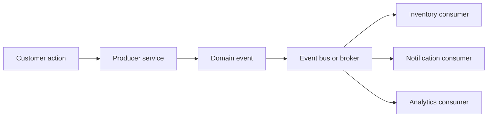

# Getting into serverless mindset

## Serverless mean

- No server management
- Flexible scaling
- Automated highly availability
- No idle capacity

What types of potential cost savings should you evaluate
when comparing serverless vs. server-based design? Select all that apply.

- Reduced cost of idle server capacity
- Benefit of shifting operational engineering focus to tasks that better
  differentiate the business
- Faster time to market

## Event-oriented Architecture



When you are designing your architecture, don't focus on this question: "What's the data that I'm storing and what operations do I need to perform against that?" Instead, ask yourself this: "What are the events that should trigger an action in my system?"

### Key Concepts

- **Event** — a record of something that happened (e.g., `user.created`, `order.placed`)
- **Producer** — the service that emits the event
- **Consumer** — the service that reacts to the event
- **Event Bus / Broker** — the infrastructure that routes events from producers to consumers (e.g., Amazon EventBridge, SNS, SQS)

### Why Event-oriented Architecture?

- **Loose coupling** — producers don't know who consumes their events; services evolve independently
- **Scalability** — consumers scale based on event volume, not server capacity
- **Resilience** — failed consumers can retry without affecting the producer
- **Auditability** — events are immutable records of what happened in your system

### AWS Services for Event-driven Serverless

| Service                | Use case                                              |
| ---------------------- | ----------------------------------------------------- |
| **Amazon EventBridge** | Rule-based routing between AWS services and SaaS apps |
| **Amazon SNS**         | Fan-out: one event published to multiple subscribers  |
| **Amazon SQS**         | Queue-based decoupling with retry and DLQ support     |
| **Amazon Kinesis**     | High-throughput real-time event streaming             |

### Common Patterns

**Fan-out (SNS → multiple SQS queues)**
One event triggers multiple independent consumers in parallel.

```
order.placed (SNS)
  ├── inventory-service (SQS → Lambda)
  ├── notification-service (SQS → Lambda)
  └── analytics-service (SQS → Lambda)
```

**Event sourcing with QLDB**
Store every state change as an immutable event log. Reconstruct any past state by replaying events.

**Dead Letter Queue (DLQ)**
Failed Lambda invocations are sent to a DLQ (SQS) for inspection and replay — never silently dropped.

### Design Recommendations

- Model your domain around events, not CRUD operations
- Keep events small and self-describing — include enough context so consumers don't need to call back
- Version your event schemas (e.g., `v1/order.placed`) to avoid breaking consumers on schema changes
- Always configure a DLQ on async Lambda invocations

Which of these statements are true with respect to severless architectures? Select all that apply.

- You can use many AWS services as Lambda event resources, including Amazon API Gateway,
  Amazon S3, Amazon Alexa, and Amazon SQS
- It is a best practice to design independent, highly cohesive, and decoupled
  Lambda functions that connect other managed services together
